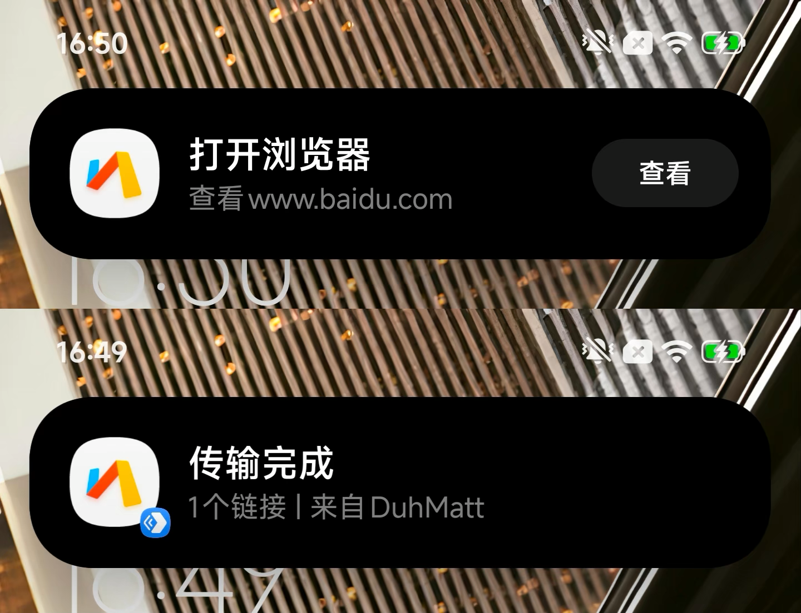

# Fxxk-MiBrowser

防止 HyperOS / MIUI 强制使用小米浏览器打开链接，改为调用系统默认浏览器。
Prevent HyperOS / MIUI from forcing links into Xiaomi Browser; redirect to the system default browser.


## 中文说明

这是一个用于 HyperOS / MIUI 的 LSPosed 模块。它只解决一个核心问题：当小米系统或系统应用拿到网页链接时，不应该强制调用小米浏览器，也不应该在小米浏览器已卸载或禁用时跳到小米应用商店的浏览器下载页，而应该交给用户在系统设置里选择的默认浏览器。

模块不会把链接硬编码到 Chrome、Edge、Firefox、Via 或任何固定浏览器。它会尽量恢复原始网页链接，清掉指向小米浏览器 / 小米应用商店的强制目标，然后让 Android 按当前默认浏览器设置继续处理。如果系统没有默认浏览器，则回到系统自己的浏览器选择器。

### 主要修复场景

1. 小米互传分享网页链接时，系统强制调用小米浏览器。
2. 系统设置里连接小米路由器后，“管理小米路由”入口强制跳转小米浏览器。
3. 小爱识屏 / 超级小爱识别到网页链接后，点击链接仍然调用小米浏览器。

### 计划加入的功能
  - 修复复制直达的浏览器跳转逻辑
  - 修复传送门搜索功能的浏览器跳转逻辑

### 效果截图



小米超级岛浏览器图标替换功能来自 [@189521394](https://github.com/189521394) 在 [#2](https://github.com/DuhMatt/Fxxk-MiBrowser/issues/2) 提出的建议，并参考了原项目 [com.fuckXiaomi.hookBrowser](https://github.com/Xposed-Modules-Repo/com.fuckXiaomi.hookBrowser) 的思路，在此感谢。

### 处理方式

- 只处理网页链接，例如 `http://` 和 `https://`。
- 移除 Intent 中指向小米浏览器的固定包名或组件。
- 识别小米应用商店的浏览器下载页跳转，例如：

```text
market://details?id=com.android.browser
mimarket://details?id=com.android.browser
```

- 尝试从小米互传、小米路由入口或小爱识屏链路里恢复原始 URL。
- 将恢复后的网页链接交给用户设置的系统默认浏览器。
- 避免影响文件、电话、短信、地图、应用私有 scheme 等非网页 Intent。

### 已测试环境

以下信息来自实机和 LSPosed 管理器：

| 项目 | 值 |
| --- | --- |
| 厂商 | Xiaomi |
| 设备型号 | `25128PNA1C` |
| 设备代号 | `nezha` |
| Android 版本 | `16` |
| Android SDK | `36` |
| HyperOS 版本名 | `OS3.0` |
| HyperOS 增量版本 | `OS3.0.307.0.WPACNXM` |
| 系统构建版本 | `16OS3.1.260514.221906302.QCPECN.S` |
| LSPosed | `2.0.2 (7668)` |
| Xposed API | `101` |
| LSPosed 管理器包名 | `org.lsposed.manager` |
| Xposed API 调用保护 | 已启用 |
| Dex 优化器包装 | 支持 |
| 测试默认浏览器 | Via (`mark.via`) |

小米互传场景，实测能从接收数据里恢复原始网页链接：

```text
点击小米互传接收通知
-> tap_recv_data
-> com.miui.mishare.tap.TapData.h
-> 原始 https 链接
-> 用户设置的默认浏览器
```

“管理小米路由”场景，系统原本会把路由器后台地址交给小米浏览器：

```text
http://192.168.1.1
-> com.android.browser
```

模块启用后会改为：

```text
http://192.168.1.1
-> 用户设置的默认浏览器
```

小爱识屏场景，实测能从小米浏览器下载页链路恢复识别到的网页链接：

```text
mimarket://details?id=com.android.browser
-> https://baidu.com
-> 用户设置的默认浏览器
```

### 使用要求

- 已 root 的 Android 设备
- LSPosed
- HyperOS 或 MIUI
- 系统里已经设置好你想使用的默认浏览器

推荐 LSPosed 作用域：

- 系统框架 (`android`)
- 小米互传 / MiShare (`com.miui.mishare.connectivity`)
- 小米应用商店 (`com.xiaomi.market`)
- 小米浏览器 (`com.android.browser`)，如果设备上存在
- 设置 (`com.android.settings`)，用于 Wi-Fi 详情页的“小米路由”入口
- HyperAI Engine (`com.xiaomi.aicr`)，用于剪贴板识别和部分识屏链路
- 超级小爱 / 小爱同学 (`com.miui.voiceassist`)，用于小爱识屏
- 翻译 (`com.xiaomi.aiasst.vision`)，部分 HyperOS 版本可能使用

### 安装

普通用户建议直接到 [Releases](https://github.com/DuhMatt/Fxxk-MiBrowser/releases) 下载已签名的 APK。

安装后，在 LSPosed 里启用模块并选择上面的作用域。改完作用域后最好重启手机；只强制停止相关应用有时也能生效，但不如重启稳。

### 构建

Debug 构建：

```bash
./gradlew assembleDebug
```

Release 构建：

```bash
./gradlew assembleRelease
```

默认生成的 release APK 没有签名。如果要分发，需要自己签名。

### 调试

常用日志 tag：

```text
HyperOSBrowserFix_Main
HyperOSBrowserFix_Intent
HyperOSBrowserFix_Resolver
```

比较有用的日志：

```text
Cached Xiaomi source URL
Recovered URL from object field
Recovered original URL from Xiaomi source cache
Default browser found
Redirecting to
```

看到 `Default browser found` 和 `Redirecting to`，通常说明模块已经把链接交回给系统默认浏览器，而不是继续走小米浏览器。

### 注意事项

HyperOS / MIUI 的内部实现经常变。这个模块只保证在上面列出的设备和系统版本上实测可用；如果换系统版本后失效，通常要重新看 LSPosed 和 logcat 日志，找到新的跳转链路再补 hook。

## English

Current version: `1.2.6`

This is an LSPosed module for HyperOS / MIUI. It fixes one core problem: when Xiaomi system components receive a web link, they should not force it into Xiaomi Browser, and they should not open Xiaomi Market's browser download page when Xiaomi Browser is removed or disabled. The link should go to the browser the user selected as the Android default browser.

The module does not hard-code Chrome, Edge, Firefox, Via, or any other browser. It tries to recover the original web URL, removes forced Xiaomi Browser / Xiaomi Market targets, and lets Android continue with the current default-browser setting. If no default browser is set, Android's normal browser chooser is used.

### Main Fixed Scenarios

1. Mi Share opens shared web links with Xiaomi Browser.
2. The "Manage Xiaomi router" entry in system Wi-Fi settings opens Xiaomi Browser.
3. XiaoAi / Super XiaoAi screen recognition opens recognized web links with Xiaomi Browser.

### Planned Features
  - Fix the browser redirection logic for “Copy Direct”
  - Fix the browser redirection logic for the “Portal Search” feature


### What It Does

- Handles only web links, such as `http://` and `https://`.
- Removes fixed Intent packages or components that point to Xiaomi Browser.
- Detects Xiaomi Market browser download-page redirects, for example:

```text
market://details?id=com.android.browser
mimarket://details?id=com.android.browser
```

- Tries to recover the original URL from Mi Share, Xiaomi router settings, or XiaoAi screen-recognition flows.
- Sends the recovered web link to the user's system default browser.
- Avoids touching files, phone links, SMS links, maps, app-private schemes, and other non-web Intents.

### Tested Environment

The values below were checked on a real device and in LSPosed Manager:

| Item | Value |
| --- | --- |
| Manufacturer | Xiaomi |
| Device model | `25128PNA1C` |
| Device codename | `nezha` |
| Android version | `16` |
| Android SDK | `36` |
| HyperOS version name | `OS3.0` |
| HyperOS incremental version | `OS3.0.307.0.WPACNXM` |
| System build version | `16OS3.1.260514.221906302.QCPECN.S` |
| LSPosed | `2.0.2 (7668)` |
| Xposed API | `101` |
| LSPosed manager package | `org.lsposed.manager` |
| Xposed API call protection | Enabled |
| Dex optimizer wrapper | Supported |
| Tested default browser | Via (`mark.via`) |

Observed Mi Share recovery path:

```text
Mi Share notification click
-> tap_recv_data
-> com.miui.mishare.tap.TapData.h
-> original https URL
-> user's default browser
```

Observed Xiaomi router path:

```text
http://192.168.1.1
-> com.android.browser
```

With the module enabled:

```text
http://192.168.1.1
-> user's default browser
```

Observed XiaoAi screen-recognition recovery path:

```text
mimarket://details?id=com.android.browser
-> https://baidu.com
-> user's default browser
```

### Requirements

- Rooted Android device
- LSPosed
- HyperOS or MIUI
- A browser already selected as the system default browser

Recommended LSPosed scope:

- System Framework (`android`)
- Mi Share (`com.miui.mishare.connectivity`)
- Xiaomi Market (`com.xiaomi.market`)
- Xiaomi Browser (`com.android.browser`), if present on the device
- Settings (`com.android.settings`), for the Wi-Fi details Xiaomi router entry
- HyperAI Engine (`com.xiaomi.aicr`), for clipboard recognition and some screen-recognition flows
- Super XiaoAi / Mi AI (`com.miui.voiceassist`), for XiaoAi screen recognition
- AI vision assistant (`com.xiaomi.aiasst.vision`), used by some HyperOS builds

### Install

For normal use, download the signed APK from [Releases](https://github.com/DuhMatt/Fxxk-MiBrowser/releases).

After installing it, enable the module in LSPosed and select the scopes above. A full reboot is the cleanest way to apply scope changes; force-stopping the scoped apps may work, but rebooting is less fiddly.

### Build

Debug build:

```bash
./gradlew assembleDebug
```

Release build:

```bash
./gradlew assembleRelease
```

The default release APK is unsigned. Sign it yourself before distributing it.

### Debugging

Useful log tags:

```text
HyperOSBrowserFix_Main
HyperOSBrowserFix_Intent
HyperOSBrowserFix_Resolver
```

Useful log lines:

```text
Cached Xiaomi source URL
Recovered URL from object field
Recovered original URL from Xiaomi source cache
Default browser found
Redirecting to
```

When `Default browser found` and `Redirecting to` appear, the module has usually handed the link back to the system default browser instead of continuing through Xiaomi Browser.

### Notes

HyperOS and MIUI internals change often. This module is tested on the device and build listed above. If it stops working on another build, the next step is to inspect LSPosed and logcat output and update the hook for the new launch path.

## License

MIT
